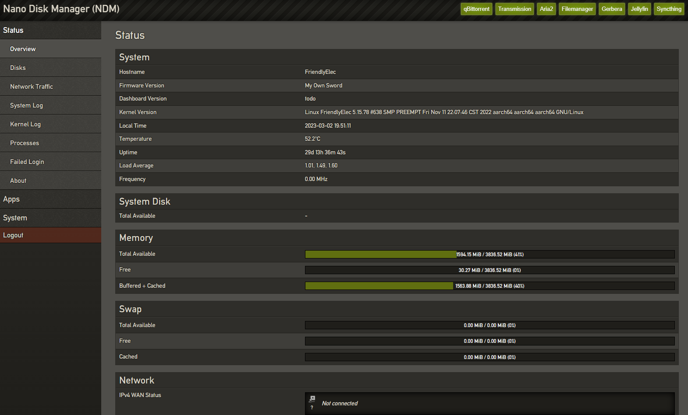

# dashboard
当年群里吹水，谈及灯大弃坑，放出豪言，“灯大不玩了，难道我们不能重新开发一个？”  荒野无灯N1、贝壳云 小钢炮 dashboard，用go gin框架
考虑到各pt软件都有web ui，目前仅完成smb，ftp，nfs等的配置

配置文件system.toml，建议手动修改
默认账号root 密码 root

个人水平精力有限，目前对本项目已经索然无趣，如有严重bug将修复，默认跑路状态

代码太low，恕不开源。。。
侵删

打赏：如果对您有帮助

